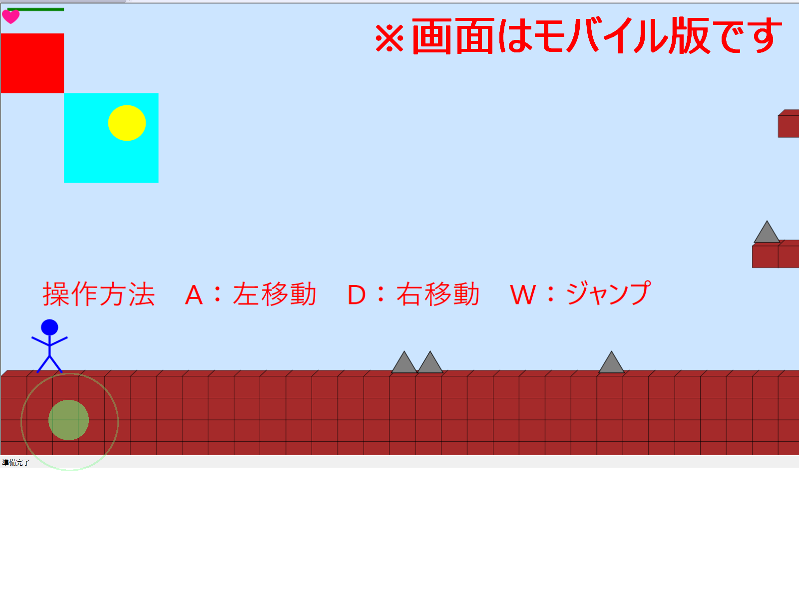
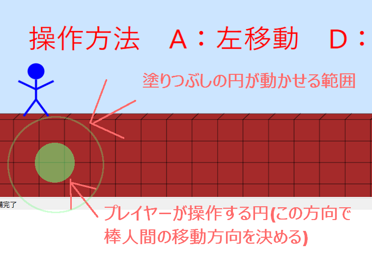

# ソフトウェア移植指示書 (Migration Specification) 

## 目次
- [ソフトウェア移植指示書 (Migration Specification)](#ソフトウェア移植指示書-migration-specification)
  - [目次](#目次)
  - [1. システム概要と目的](#1-システム概要と目的)
    - [1.1 基本情報 (Overview)](#11-基本情報-overview)
    - [1.2 背景と開発方針](#12-背景と開発方針)
    - [1.3 環境](#13-環境)
    - [1.4 参照資料Zip内フォルダの説明](#14-参照資料zip内フォルダの説明)
    - [1.5 移植元の仕様と構造 (Source Environment)](#15-移植元の仕様と構造-source-environment)
  - [2. UI/UX設計](#2-uiux設計)
    - [2.1 基本方針](#21-基本方針)
    - [2.2 画面UI仕様](#22-画面ui仕様)
      - [① ゲームメイン画面](#-ゲームメイン画面)
  - [3. プレイヤーの変身について](#3-プレイヤーの変身について)
    - [3.1　チビ状態](#31チビ状態)
    - [3.2  標準状態](#32--標準状態)
    - [3.3  多段ジャンプ状態](#33--多段ジャンプ状態)
    - [3.4  赤状態](#34--赤状態)
    - [3.5  最終状態](#35--最終状態)
  - [4.操作方法](#4操作方法)
  - [5. 描画用プログラムとコントローラ―プログラムの分離](#5-描画用プログラムとコントローラプログラムの分離)
  - [6.SideViewGameSampleView.cppとRendererクラス](#6sideviewgamesampleviewcppとrendererクラス)
  - [7. 移植先の要件 (Target Environment)](#7-移植先の要件-target-environment)
    - [7.1 ディレクトリ構成 (Directory Structure)](#71-ディレクトリ構成-directory-structure)
  - [8. アーキテクチャ設計（DDD準拠）](#8-アーキテクチャ設計ddd準拠)
    - [8.1 ユビキタス言語リスト](#81-ユビキタス言語リスト)
  - [9. 非機能要件・技術制約](#9-非機能要件技術制約)
    - [9.1 AIへの出力制約](#91-aiへの出力制約)
    - [9.2 フレームワーク・ライブラリの指定](#92-フレームワークライブラリの指定)
    - [9.3 Webサーバーとアプリの起動について](#93-webサーバーとアプリの起動について)
  - [10. コーディング規約・実装方針 (Coding Standard)](#10-コーディング規約実装方針-coding-standard)
  - [11. 移行時の変更・リファクタリング要件](#11-移行時の変更リファクタリング要件)
  - [12. 動作確認](#12-動作確認)
    - [12.1 移植元の動作確認方法(AI用)](#121-移植元の動作確認方法ai用)
  - [13. 単体テスト実施要件 (UT Testing)](#13-単体テスト実施要件-ut-testing)

## 1. システム概要と目的
### 1.1 基本情報 (Overview)
*   **目的**: 既存のSideViewGameSampleアプリをWebアプリケーションへ移植する。
*   **移植元 (Source)**: C++ 20標準/ MFC + Direct2D
*   **移植先 (Target)**: TypeScript 6.0.3

### 1.2 背景と開発方針
本指示書は、AIによる自動開発に最適化されており、
設計の曖昧さを排除した厳密な指示セットである。
開発にあたっては、既存の仕様、及びフローを維持するため、
移植元のUI/UX及びデータ処理順序を完全に再現すること。

### 1.3 環境
*  **動作環境OS**：Windows11以降
*  **動作ブラウザ**：GoogleChromeを標準とする。他のブラウザを使用してもレイアウト崩れが起きないようにすること。
*  **ゲーム画面サイズ**: `1280 x 720（16:9アスペクト比）`とし、ブラウザのサイズに合わせてアスペクト比を維持したまま
                        拡大縮小（フィット）させる。

### 1.4 参照資料Zip内フォルダの説明
添付Zipファイル（`SideViewGameSample移植参照資料.zip`）の中身は以下の通りである。
*   **移植元_SideViewGameSampleアプリ本体**: 移植元となるアプリ本体のフォルダ
*   **SideViewGameSampleソフトウェア開発指示書.md**: 当開発指示書
*   **images**: 当開発指示書から参照する画像ファイルが入っているフォルダ

### 1.5 移植元の仕様と構造 (Source Environment)
移植元であるSideViewGameSampleアプリは、画面左側にいるプレイヤー(以降、「棒人間」)を左右に移動させ、
ゴールを目指すという横スクロールアクションゲームである。

## 2. UI/UX設計
### 2.1 基本方針
**現行アプリケーションと同様のUI(ボタンや文字配置、文字色、フォント等)**とする。

### 2.2 画面UI仕様
**現行アプリの画面のレイアウトおよび操作感を完全に準拠**すること。
また、**画面の色、棒人間、障害物、及び障害物の色も移植元と完全に準拠**すること。

#### ① ゲームメイン画面
 

* **UIの解説**: 
    * ゲームを開始するとステージの先頭から始まる。画面左端の棒人間がブロックタイルの上に立っており、これを主人公として操作する。
    * 棒人間を中央辺りまで移動させると画面(カメラ)がスクロールする。
    * 道中でトゲや穴などの障害物があり、これらを棒人間がジャンプすることで避けて進む。
    * 最後に緑色の丸オブジェクトがあり、これを触れることでゴールとなる。

* **地形の表示**: 
    * 画面の主人公が進むための地形が茶色のブロックタイルとして配置されている。主人公はいかなる場合でもブロックタイルを貫通して進むことはできない。
    * 地形や各種ブロックは立体的な立方体を画面に描画する。色も移植元と準拠すること。

* **体力の表示**: 
    * 画面の左上には棒人間の体力を示すハートがある。ハートが１つの状態の時にトゲや敵に触れるとミスとなり、ハートがすべて消える。
    * 5秒経過後に主人公はそのステージの頭から再スタートとなる。
    * 棒人間の変身状態によってハートの数と連動している。

* **パワーアップアイテムの表示**: 
    * 赤いブロックはパワーアップアイテムである。棒人間がこれに触れると色々な姿に変身する。
    　この姿と画面左上の体力のハートの数と連動している。

* **文字の表示**:
    * ミスすると、画面中央辺りに`ミス・・・`と表示されて、5秒間棒人間の操作ができなくなり、
    　その後ステージの先頭から再開する。
    * ゴールすると、画面中央辺りに`ゴール！！`と表示されて、5秒間棒人間の操作ができなくなり、
    　その後ステージの先頭から再開する。

* **【追加仕様】モバイル版での画面の向き変更**:
    * 追加仕様として、スマホやタブレットなどモバイル端末で当ゲームを起動した場合にのみ、
    * **画面は`横向きに固定`されるようにすること(当ゲーム以外がアクティブになった場合には`元の画面の向きに戻る`こと)**
    * ブラウザ自体を横向きにすることが不可能である場合は、ブラウザはそのままで、**ゲーム画面（Canvas）自体の方を**
    * **自動的に90度回転(例として、CSSの回転処理（`transform: rotate(90deg)`等）を用いる)させ**、
    * 横向きの状態で画面いっぱいにフィットさせて表示すること。
    * これにより、ユーザーが端末をどのように持っても、ゲーム自体は常に「16:9の横スクロール画面」として
    * 操作・プレイできるように実装すること。
    * これはモバイル版で起動した場合のみであり、**PC版の場合は画面の向きは絶対に変更しない**

* **実装時の注意点**:
    * 移植先のHTML/テンプレート生成、またはフロントエンド向けのAPIエラーレスポンス
    * （`401 Unauthorized` など）は、このUIの挙動と矛盾しないように実装すること。

## 3. プレイヤーの変身について
棒人間が赤いブロックに触れるたびに、棒人間は以下のように変身する。
**棒人間の変身の状態と、体力が連動**している。
チビ状態(体力1)　→　標準状態(体力2) →　多段ジャンプ状態(体力3) →　赤状態(体力4) →　最終状態(体力5)

### 3.1　チビ状態
チビ状態ではジャンプは１段ジャンプとなる。トゲや敵にあたるとミスとなる。

### 3.2  標準状態
標準状態では２段ジャンプができる。トゲや敵にあたるとチビ状態になる。

### 3.3  多段ジャンプ状態
多段ジャンプ状態では空中で何度でもジャンプできる状態になる。トゲや敵にあたると標準状態になる。　

### 3.4  赤状態
多段ジャンプ状態と同じ。トゲや敵にあたると多段ジャンプ状態になる。

### 3.5  最終状態
空中を自由に移動できるようになる。トゲや敵にあたると赤状態になる。

## 4.操作方法
ブラウザーからキーボード入力を受け付けるようにし、棒人間を操作できるようにする。
*   **左移動**: キーボードの`A`
*   **右移動**: キーボードの`D`
*   **ジャンプ**: キーボードの`W`

* **【追加仕様】モバイル版でのスティックコントローラ―UIの表示**:
  
    * 追加仕様として、スマホやタブレットなどモバイル端末で当ゲームを起動した場合にのみ、
    *　**半透明なスティックボタンのUIが画面の左下部分に配置**されるようにする。(モバイル版にキーボードが無いため)
    *　詳細は上記画像を参照すること。
    *  プレイヤーが操作する塗りつぶしされた円(以降「`スティックボタン`」)と、
    *  そのスティックボタンを動かすことのできる範囲を表した円(以降「`範囲円`」)
    *  (実際には円の中心から上半分の半円の範囲しか動かせない)の2つのオブジェクトがある。
    *　スティックボタンは**原点座標(2つの円の中心点)を原点として、範囲円の範囲のうち、180°**
    *  **(範囲円の中心から上半分の半円)の範囲で自由に動かすことができ、**
    *　**スティックを動かした方向によって棒人間の操作を対応させる**ようにする。
    *　**何も入力がない(タッチスクリーンから指が離される)時には、スティックボタンは一瞬で原点に戻るようにする**
　　 *　具体的には以下の通りである。
　　 *    **0~45°**：棒人間は`右`に移動する     = キーボードの`Dキー`を押したときと同じ
    *     **46~60°**：棒人間は`右上`に移動する  = キーボードの`Wキーと、Dキー`を同時に押したときと同じ
    *     **61~120°**：棒人間は`上`に移動する   = キーボードの`Wキー`を押したときと同じ
    *     **121~135°**:棒人間は`左上`に移動する = キーボードの`Wキーと、Aキー`を同時に押したときと同じ
    *     **136~180°**：棒人間は`左`に移動する　= キーボードの`Aキー`を押したときと同じ
    * これはモバイル版で起動した場合のみであり、**PC版の場合は絶対にスティックを表示しないこと。**。

## 5. 描画用プログラムとコントローラ―プログラムの分離
移植元C++プロジェクトでは、**描画用プログラム(*Object.cpp)と、それをコントロールするためのコントローラプログラムは**
**それぞれ別々のクラスファイルに分けて設計されており、**コントローラーのインスタンスに描画用のインスタンスを依存性注入することにより
描画されているオブジェクトを動かすように設計されている。
GameMainクラスで描画用インスタンスとコントローラー用インスタンスを生成させ、GameMainクラスで依存性注入も行っている。
今回のTypeScriptの移植においても、**同様の設計構造とする**こと。

## 6.SideViewGameSampleView.cppとRendererクラス
**SideViewGameSampleView.cppでは、ゲームの心臓部となる60FPSの**
**ゲームループ等が実装されている。**これらと同等機能の移植のために、
新規のクラスを作成することを認める。
また、移植元では画面に絵を描画するための`Rendererクラス`というものがあるが、
**移植に際し不要であれば、Rendererクラスを無理に用意する必要は無い。**

## 7. 移植先の要件 (Target Environment)
移植先の実装では、以下の環境および構成を厳守すること。

### 7.1 ディレクトリ構成 (Directory Structure)
移植元のファイル構成に完全に準拠した以下の構成にすること。
実装内容の中身については、移植元の同名クラスファイル(.hや.cpp)を参照すること。
機能実現にあたり、以下の構成以外で新規で追加するべきクラスや単体テストのクラスの追加は認める。
.
src/
│────GameLibrary/
│       └─　GameLibrary.ts                   # C++側の自作ゲームライブラリ（共通処理）
│       
│────GameLogic/
│  　   └────GameObject　                    # 描画用プログラム
│  　   │     ├─　BlockObject.ts             # ブロックタイルの描画プログラム(TileMapObjectの子)
│       │     ├─  CircleObject.ts            # 円の描画プログラム
│       │     ├─  GoalObject.ts              # 緑色の丸のゴールの描画プログラム(TileMapObjectの子)
│       │     ├─  KillBlockObject.ts         # 棒人間の死亡タイルの描画プログラム(TileMapObjectの子)
│       │     ├─  LineObject.ts              # 直線の描画プログラム
│       │     ├─  PlayerObject.ts            # 棒人間の描画プログラム
│       │     ├─  PowerUpBlock1Object.ts     # パワーアップブロックタイルの描画プログラム(TileMapObjectの子)
│       │     ├─  RectObject.ts              # 矩形の描画プログラム
│       │     ├─  StageMapObject.ts          # 地形全体の描画プログラム
│       │     ├─  TextObject.ts              # テキスト(文字列)の描画プログラム
│       │     ├─  ThornBlockObject.ts        # トゲの描画プログラム(TileMapObjectの子)
│       │     └─  TileMapObject.ts           # タイルの描画プログラム
│       │
│　　　　└────Controller　                    # コントローラーのプログラム
│ 　　　│　  　└─  PlayerController.ts       # プレイヤーのコントローラ―プログラム
│       ├─  Camera.ts                  # カメラ
│       ├─  CollisionResult.ts         # x,yの変数を持つ構造体
│       ├─  GameMain.ts                # ゲームのメインとなるプログラム
│       ├─  InputKey.ts                # キー入力
│       ├─  PowerUpLevel.ts            # 棒人間のパワーアップ情報をまとめた列挙体
│       ├─  Renderer.ts                # C++で画面描画を行うために必要だったが、移植で不要であれば削除でOK
│       ├─  StageMap.ts                # 地形に関する制御を行う
│       └─  TileType.ts                # 各タイル情報をまとめた列挙体
│
│────main.ts                          # アプリの開始地点（エントリーポイント）
│────tests/                            # 単体テスト用のフォルダ
│       └─  game_test.ts               # ロジックや当たり判定が正しいか検証するテストコード
│
├─── index.html                        # ブラウザが最初に読み込む、アプリ全体の土台となるHTML
├─── package.json                      # TypeScriptのバージョン、起動コマンド等を管理するファイル
└─── tsconfig.json                     # TypeScriptのコンパイル（C++でいうビルド）設定ファイル
※TileMap.h及び.cppはプログラム内で未使用のため、移植不要

## 8. アーキテクチャ設計（DDD準拠）
### 8.1 ユビキタス言語リスト
| 日本語 | 英語 | 説明              |
| ------ | ---- | ----------------- |
| 棒人間   | StickMan | 操作する主人公である、プレイヤーキャラクターのこと |
| ２段ジャンプ | Doublejump | 棒人間が、ジャンプした後でもう一度ジャンプボタンを押すことで、更に空中でジャンプすること |

## 9. 非機能要件・技術制約
### 9.1 AIへの出力制約
・UIの移植元準拠:  複雑なインタラクティブコンポーネントの生成については、**移植元のアプリに準ずる**。
・ログ出力:  全ての処理プロセス、バリデーション結果、エラーログは、標準コンソールに
　　　　　　「`Markdownテーブル形式`」のテキストとして出力すること。

### 9.2 フレームワーク・ライブラリの指定
* **言語**：TypeScript 6.0.3
* **フレームワーク**：プログラミング学習のため、ゲームエンジン及びゲームのフレームワークの使用を一切禁止する。
　　　　　　　　　　　 それ以外のフレームワークの使用は認める。
* **描画方式**:外部のゲームエンジンは使用せず、HTML5の標準機能である` HTML5 Canvas API `を使用して
              2D（またはDirect2D風の立体）描画を行う。
* **ゲームループ** : `requestAnimationFrame` を用いた一般的なゲームループ（毎秒60フレーム：60FPS想定）を実装し、
                    時間経過（デルタタイム）に応じてオブジェクトの位置を更新・描画する構造にすること。これを実現するためのクラスの追加を認める。

* **画面のレスポンシブ・フィット制約**:
* Canvasの拡大縮小・回転を行う場合は、ゲーム内部の座標更新ロジックに一切影響を与えない形で、
* ブラウザの表示領域にフィッティングさせる構造（例として、CSSレターボックス・CSS回転方式）にすること。

### 9.3 Webサーバーとアプリの起動について
当アプリケーションは、本番Webサーバー(GitHub Pagesを想定)に配置し、
リクエストを受けてサーバーから起動する(ブラウザ完結型ではない)、
静的Webアプリケーションである。

当アプリケーションは、ブラウザが最初に読み込む、
アプリ全体の入口のHTMLである `index.html`　を全ての起点として
起動する設計とすること。
`それ以外は一切認めない。名前もindex.htmlであり、名前の変更も`
`一切認めない。`
サーバーから呼び出される上記仕様のため、案として、index.htmlでは、
以下のscriptタグが記載されており、他のロジックが書かれていない、
ゲーム本体のプログラムを呼び出すためだけのシンプルな形を想定している。
* ** `` **

なお、案としては開発には以下のようなコマンドの使用を想定している。
* **npm install**:
初回起動やエラー、アプリが動作しないときには上記コマンドを実行する。

* **npm run dev**:
ローカル環境で動作確認をする際には、上記のコマンドで開発サーバーを起動する。

* **npm run build**:
完成した際には、上記のコマンドでリリース品を生成し、Webサーバに配置する。

## 10. コーディング規約・実装方針 (Coding Standard)
AIはコードを生成する際、以下のルールを必ず適用すること。

* **命名規則**:
 ・TypeScriptの**一般的な慣習（メソッド名・構造体名はキャメルケース）に従う**こと。
 ・インターフェースはその旨がわかるよう、名前の先頭に『`I`』を付けること。
 ・基本的には**1クラス(クラス、インターフェース、構造体)1ファイル**で構成されているため、
   各ファイルの記載内容に従うこと。
 ・基本的に**クラス、インターフェース、構造体とファイル名は必ず同一**であること。
 ・**メソッド名とフィールド名についても基本的に移植元と同じにする**こと。ただし、　TypeScriptの一般的な命名規則の慣習によって、大文字小文字の変更は許可する。

* **関数、メソッド**:
各**ファイル(tsファイル)はそれぞれがクラスや構造体のファイル**となっており、
各クラスファイル内で使用されている**メソッドは過不足なく全てそのまま移植**すること。
1ファイル(クラス、インターフェース、構造体)のメンバ関数、メソッドは
移植元に完全に準拠し、**`勝手な削除や追加は一切認めない`**。

* **変数、フィールド**:
各ファイルに存在するフィールドやローカル変数も、基本的にはそのまま移植すること。

* **エラーハンドリング**:
例外は発生させず、TypeScriptの標準的な形式で呼び出し元に明示的にエラーを返すこと。
ログ出力には標準ライブラリを使用すること。

* **コードの省略禁止**:
// TODO: 実装をここに書く や // 省略 といった、**コメントでのごまかしは一切禁止**する。
すべてのロジックを完全に記述すること。

## 11. 移行時の変更・リファクタリング要件
ゲームの操作感や挙動を完全に一致させるため、勝手なアルゴリズムの変更は一切禁止とする。

* **親クラスと子クラスの完全移植**:
  * タイルブロック等、親クラスから継承して子クラスを作成しているクラスがある。
  　ポリモーフィズムを実現するために、C++では親クラスのスマートポインタの変数に
  　子クラスのインスタンスを参照する形となる。
  　TypeScriptでも同様に親クラスの変数に子クラスを代入し、ポリモーフィズムを実現
  　すること。

* **物理演算（重力・移動・ジャンプ）の完全移植**:
  * 棒人間の移動速度、ジャンプの初速度、毎フレームかかる重力の計算、および摩擦などの物理挙動は、移植元C++コードのロジック（座標更新の計算式）を
  　**そのまま愚直に直訳して再現する**こと。
  * AIの判断で独自の物理エンジンや、一般的な物理公式をゼロから導入することは禁止する（ゲームの操作感を完全に一致させるため）。

* **当たり判定（コリジョン）アルゴリズムの維持**:
  * 棒人間とブロックタイル、障害物との当たり判定、および衝突時の位置補正（めり込み防止処理）についても、**移植元C++コード（主に当たり判定を**
  　**担当しているクラスや、そのメソッド）のアルゴリズムをそのまま参考**にすること。

* **移植元ロジックの完全準拠（最重要）**:
  * 物理計算（重力・移動・ジャンプ）だけでなく、ゲーム内のすべてのアルゴリズム（当たり判定、変身状態の切り替え、ステージ生成など）は、
  　 移植元C++コードの処理フローや計算式を**そのまま愚直に直訳して再現**すること。
  * 「TypeScriptならこう書いたほうが効率が良い」といった**AIの自己判断によるロジックの改変、最適化、アルゴリズムの差し替えは一切禁止**する。
  　　ゲームの挙動やバグ（仕様としての挙動）まで完全に一致させることが最優先である。
  　　この完全再現の為の手段として、単なる直訳ではなく、適宜TypeScriptのコーディングに適した最適化を行うことは認める。

## 12. 動作確認
実装完了後、動作確認を行い、当指示書記載内容が漏れなく満たせているかを確認すること。

### 12.1 移植元の動作確認方法(AI用)
移植元アプリの挙動やテストを確認したい場合は、ゲーム起動後に以下のように棒人間を操作するとよい。
*   **左移動**: キーボードの`A`
*   **右移動**: キーボードの`D`
*   **ジャンプ**: キーボードの`W`

## 13. 単体テスト実施要件 (UT Testing)
動作確認完了後、単体テスト(UT)を仮想実行環境にて実施すること。
実施に際し、まずは対応するユニットテスト（単体テスト）のテストケース（例: *_testケース.xls）
及びテストコード（例: *_test.ts）をセットで生成すること。
ただし、本体のファイルと混ざらないようにするため、
本体のディレクトリにテスト用のフォルダ(src/tests)を別に用意し、その中に生成したファイルを入れること。
正常系だけでなく、異常系のテストケースを必ず含めること。